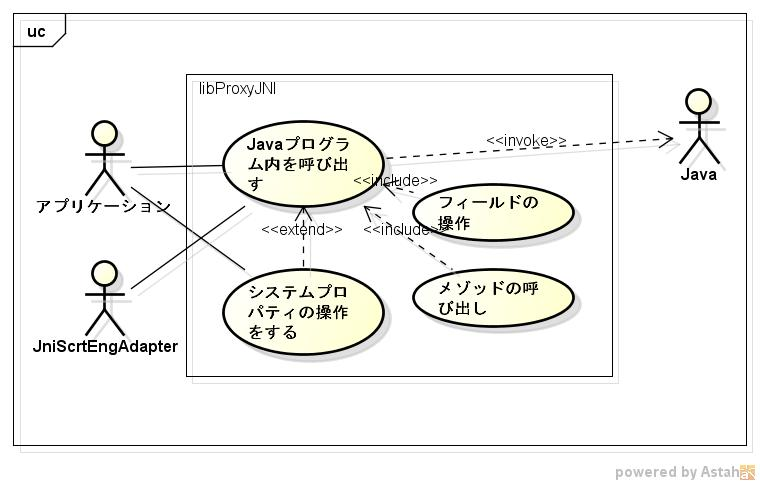

libproxyjni
===========
c言語からjavaプログラムを呼び出すライブラです。

## Description ##
  
詳細は、https://github.com/siranovel/libproxyjni/wiki

## Demo ##

## VS. ##

## Requirement ##

java11に依存

## Usage ##

## install ##

    git clone https://github.com/siranovel/libproxyjni.git  
    cd libproxyjni  
    rpm -ivh <rpmファイル名>

## Contribution ##

## Licence ##

## Author ##
