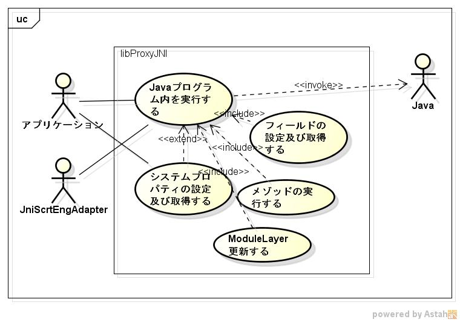

libproxyjni
===========
c言語からjavaクラス内のメゾッドの呼び出しライブラリです。

## Description ##
  
詳細は、https://siranovel.github.io/mydocs/proxyjni/lib  

## Demo ##

## VS. ##
* libproxyjni  vs swig.  
  

  

## Requirement ##
ver 2.2.0以降 java11に対応  
それ以前      java8に対応

## Usage ##

## install ##

    git clone https://github.com/siranovel/libproxyjni.git  
    cd libproxyjni  
    rpm -ivh <rpmファイル名>

## Contribution ##

## Licence ##

[GPLv2](LICENSE)

## Author ##

[siranovel](https://github.com/siranovel)
